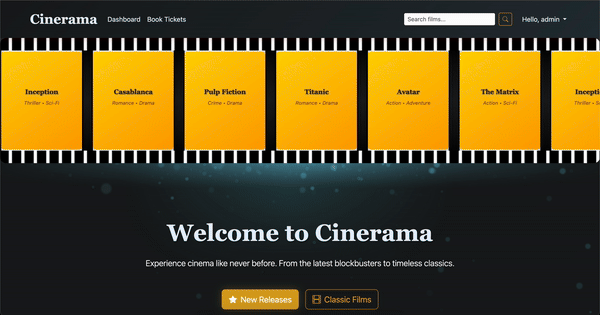
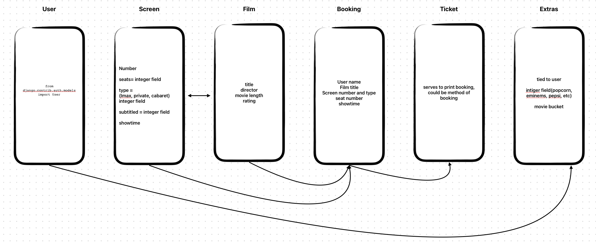
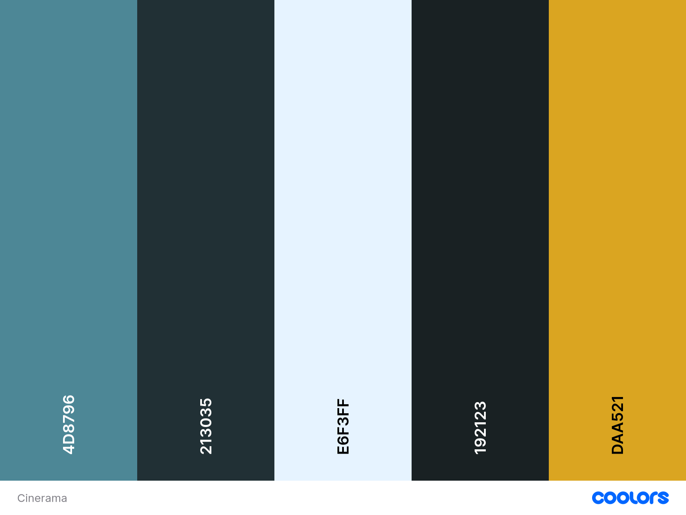

# Cinerama

### [⛓️ Click Here To see The Live Website](https://cinerama-project-c41e4c3cc388.herokuapp.com/)

Cinerama is our awesome way of showcasing an e-commerce website.
From displaying dynamic prices to having a manageable booking/cart. Using TMBD API to show titles, posters, cast and
more.
YouTube API to fetch appropriate trailers for the films and a Copilot API that creates age ratings.
This web app was a big package and lots of fun to work on. It has tons of room for improvement.
But even now, comparing it to other cinema websites we are quite happy with the design and logic behind it.

| **Collaborator** | responsible for:                 | linked-in                                                               | GitHub                                      |
|------------------|----------------------------------|-------------------------------------------------------------------------|---------------------------------------------|
| James Flower     | Project Lead / Full-Stack dev    | [James](https://www.linkedin.com/in/jamesfowler21/)                     | [James](https://github.com/jamesfowler-dev) |
| Amy Cartwright   | Full-Stack dev                   | [Amy](https://www.linkedin.com/in/amy-cartwright-624498279/)            | [Amy](https://github.com/AC-dev16)          |
| Thomas Clevely   | Full-Stack dev                   | [Thomas](https://www.linkedin.com/in/thomas-clevely-2a4289389/)         | [Thomas](https://github.com/Ruon90)         |
| Rafael Sanchez   | Ideation, Drafting and debugging | [Rafael](https://www.linkedin.com/in/rafael-horwood-sanchez-291914224/) | [Rafael](https://github.com/RH1945)         |

# Index

- [Overview](#overview)
- [UX Design](#ux-design)
- [User Stories](#user-stories)
- [ERD](#erd)
- [Colors](#colors)
- [Font](#font)
- [Key Features](#key-features)
- [User Authentication & Management](#user-authentication--management)
- [Data Management](#data-management)
- [Deployment](#deployment)
- [AI Implementation](#ai-implementation)
- [Testing](#testing)
    - [Desktop Lighthouse Reports](#desktop-lighthouse-reports)
    - [Mobile Lighthouse Reports](#mobile-lighthouse-reports)
    - [HTML Validation](#html-validation)
    - [CSS Validation](#css-validation)
    - [Python Validation](#python-validation)
    - [JavaScript Validation](#javascript-validation)
    - [Manual Testing](#manual-testing)
- [Future Enhancements](#future-enhancements)
- [Credits](#credits)

---

# Overview

Cinerama is a full-stack cinema booking web application built using Django and PostgreSQL.
The platform allows users to browse films, view showtimes, select seats, and manage
bookings through a clear, multi-step booking flow.

The project was developed as a capstone hackathon application, with a strong focus on
user experience, real-world data relationships, and deployment readiness.
External APIs such as TMDB and YouTube are used to enrich the platform with up-to-date
film metadata, posters, and trailers.

While the application delivers a complete and functional MVP, the architecture also
leaves room for future refactoring and feature expansion beyond the hackathon scope.

---

# UX Design

### Templates

Our template design was inspired by Odeon and Everyman cinema websites, in addition to an idea of having
a local cinema showing classic films. 

 

---

# User Stories

User stories were tracked and managed using a GitHub Projects board, allowing the team
to prioritise core functionality while keeping future ideas clearly documented.

### Completed User Stories

- As a user, I can register an account so that I can manage my bookings
- As a user, I can browse available movies
- As a user, I can view film trailers
- As a user, I can search and filter films
- As a user, I can book tickets for a selected film and showtime
- As a user, I can view seat availability before booking
- As a user, I can edit an existing booking
- As a user, I can delete a booking
- As an admin, I can add new films and metadata via the admin panel
- As a user, I can view film ratings and reviews
- The application is responsive across a wide range of devices

### Future User Stories

- As a user, I can rate or review films
- As a user, I can switch between light and dark mode
- As a user, I can share film pages via social media
- As a user, I can add films to a personal watchlist

---

# ERD

The Entity Relationship Diagrams (ERDs) are essential for defining the data structure,
relationships, and constraints within the Cinerama booking system.
They were designed early in the project to ensure consistency between the database,
business logic, and user interactions throughout the cinema booking flow. Read more...

 

## Relationship Summary

| From     | To          | Relationship | On Delete |
|----------|-------------|--------------|-----------|
| Screen   | Seat        | One-to-Many  | CASCADE   |
| Screen   | Showtime    | One-to-Many  | CASCADE   |
| Film     | Showtime    | One-to-Many  | CASCADE   |
| Showtime | Booking     | One-to-Many  | CASCADE   |
| User     | Booking     | One-to-Many  | CASCADE   |
| Booking  | BookingSeat | One-to-Many  | CASCADE   |
| Seat     | BookingSeat | One-to-Many  | CASCADE   |

### ERD Cardinality Overview

- Screen
    - ├── 0..* Seat
    - └── 0..* Showtime
- Film
    - └── 0..* Showtime
- Showtime
    - └── 0..* Booking
- User
    - └── 0..* Booking
- Booking
    - └── 0..* BookingSeat
- Seat
    - └── 0..* BookingSeat

---

Screen

 

| Field Name | Type         | Constraints        | Description                          |
|------------|--------------|--------------------|--------------------------------------|
| id         | AutoField    | PK                 | Unique screen identifier             |
| type       | IntegerField | choices, default=0 | Screen type (Silver, IMAX, VIP etc.) |
| number     | IntegerField | required           | Screen number                        |
| seats      | IntegerField | required           | Total number of seats                |

**Notes:**

- `type` and `number` are unique together to prevent duplicate screens.

Film

 

| Field Name     | Type            | Constraints            | Description               |
|----------------|-----------------|------------------------|---------------------------|
| id             | AutoField       | PK                     | Unique film identifier    |
| title          | CharField       | required               | Film title                |
| director       | CharField       | required               | Film director             |
| cast           | TextField       | required               | Main cast members         |
| year           | DateField       | required               | Release year              |
| duration       | IntegerField    | required               | Duration in minutes       |
| rating         | CharField       | choices, default=PG    | Age rating                |
| genre          | CharField       | choices, default=drama | Film genre                |
| synopsis       | TextField       | optional               | Film synopsis             |
| poster_url     | CharField       | optional               | Poster image URL          |
| backdrop_url   | CharField       | optional               | Backdrop image URL        |
| trailer_url    | URLField        | optional               | Trailer video URL         |
| tmdb_id        | PositiveInteger | unique, optional       | External TMDB reference   |
| is_new_release | BooleanField    | default=True           | New release flag          |
| is_classic     | BooleanField    | default=False          | Classic film flag         |
| is_active      | BooleanField    | default=True           | Active listing status     |
| created_at     | DateTimeField   | auto                   | Record creation timestamp |
| updated_at     | DateTimeField   | auto                   | Last update timestamp     |

Showtime

 

| Field Name   | Type                | Constraints  | Description                |
|--------------|---------------------|--------------|----------------------------|
| id           | AutoField           | PK           | Unique showtime identifier |
| film         | ForeignKey → Film   | CASCADE      | Film being shown           |
| screen       | ForeignKey → Screen | CASCADE      | Screen used for showing    |
| date         | DateField           | required     | Showtime date              |
| time         | TimeField           | required     | Showtime time              |
| price        | DecimalField        | required     | Ticket price               |
| is_available | BooleanField        | default=True | Availability status        |

**Notes:**

- Screen, date, and time are unique together to avoid scheduling conflicts.
- Available seats are calculated dynamically.

Seat

 

| Field Name | Type                | Constraints | Description                        |
|------------|---------------------|-------------|------------------------------------|
| id         | AutoField           | PK          | Unique seat identifier             |
| screen     | ForeignKey → Screen | CASCADE     | Screen this seat belongs to        |
| row        | CharField           | required    | Seat row (A, B, C...)              |
| number     | IntegerField        | required    | Seat number                        |
| seat_type  | CharField           | default     | Standard, premium, wheelchair etc. |

**Notes:**

- Seats are uniquely identified by screen, row, and number.

Booking

 

| Field Name     | Type                  | Constraints      | Description                 |
|----------------|-----------------------|------------------|-----------------------------|
| id             | AutoField             | PK               | Internal booking identifier |
| booking_id     | UUIDField             | unique           | Public booking reference    |
| user           | ForeignKey → User     | CASCADE          | Booking owner               |
| showtime       | ForeignKey → Showtime | CASCADE          | Showtime booked             |
| booking_date   | DateTimeField         | auto             | Booking timestamp           |
| total_price    | DecimalField          | required         | Total booking price         |
| status         | CharField             | choices, default | Booking status              |
| payment_method | CharField             | optional         | Payment method used         |

BookingSeat

 

| Field Name | Type                 | Constraints | Description                    |
|------------|----------------------|-------------|--------------------------------|
| id         | AutoField            | PK          | Unique booking-seat identifier |
| booking    | ForeignKey → Booking | CASCADE     | Associated booking             |
| seat       | ForeignKey → Seat    | CASCADE     | Reserved seat                  |
| price      | DecimalField         | required    | Seat price                     |

**Notes:**

- Each seat can only be booked once per booking.

This was the first sketch for the ERDs:

---

# Colors

Colors were chosen to mimic Kodak film and a dark-mode web experience. with a special background 
of light bokeh to inspire the cinematic feeling.

 

---

# Font

Cinerama uses a combination of classic serif and clean sans-serif fonts to evoke a
traditional cinema aesthetic while maintaining readability and accessibility.

The primary typography is based on serif fonts such as **Georgia** and **Times New Roman**,
used for headings and branding elements to reinforce a cinematic, theatrical feel.
Secondary sans-serif fonts like **Arial** and **Helvetica** are used for body text,
navigation, and UI elements to ensure clarity across devices.

Font variables are defined globally using CSS custom properties, allowing consistent
usage and easy future refactoring or replacement.

---

# Key Features

- **Film browsing and discovery**
    - Browse active films with posters, genres, ratings, and trailers
    - Dynamic filtering by date, genre, and search keywords

- **Multi-step booking flow**
    - Select film and showtime
    - Choose seats using an interactive seat map
    - Review booking and confirm purchase
    - View booking confirmation with unique booking ID

- **Real-time seat availability**
    - Seats are dynamically marked as available, selected, or booked
    - Seat conflicts are prevented at database level and revalidated server-side

- **Booking management**
    - Users can view, edit, or delete their existing bookings
    - Re-select showtimes and seats for future bookings

- **Admin cinema management**
    - Admin users can manage films, screens, showtimes, seats, and bookings
    - Read-only and filtered admin views ensure data integrity

---

# User Authentication & Management

Cinerama uses Django’s built-in authentication system enhanced with **django-allauth**
to provide secure and scalable user management.

- User registration, login, and logout are handled via Django Allauth
- Authentication is required for booking confirmation and booking management
- Anonymous users may browse films and showtimes but must log in to complete a booking
- User sessions are used to temporarily store booking progress before authentication
- Role-based access:
    - Regular users can manage their own bookings
    - Staff users have access to the Django admin panel for content management

Redirects and permissions are enforced using decorators and middleware to ensure a
secure and consistent user experience.

---

# Data Management

Data persistence and integrity are handled using Django’s ORM with a relational
PostgreSQL database.

- Clear separation of entities: Film, Screen, Showtime, Seat, Booking, and BookingSeat
- Foreign key relationships enforce real-world cinema constraints
- Composite uniqueness constraints prevent duplicate screens, seats, and showtimes
- Cascading deletes ensure orphaned data is not retained
- Calculated properties (e.g. available seats) avoid redundant storage
- Admin configuration includes filters, search, and read-only fields for sensitive data

All business logic related to availability and conflicts is validated server-side,
ensuring consistent behavior regardless of client state.

---

# Deployment

The application is deployed to **Heroku** using a production-ready Django configuration.

- **Gunicorn** is used as the WSGI HTTP server
- **PostgreSQL** is used as the production database via `dj-database-url`
- **WhiteNoise** handles static file serving
- Environment variables are used for sensitive configuration:
    - SECRET_KEY
    - DATABASE_URL
    - TMDB_API_KEY
- DEBUG mode is disabled in production
- Static files are collected and served from a dedicated static directory

The deployment setup allows the application to scale while keeping configuration
secure and environment-agnostic.

---

# AI Implementation

AI tools were used during the development process primarily as **assistive tools**
rather than as core application logic.

- AI was used for:
    - Drafting website content
    - Debugging assistance
    - Generating boilerplate code
    - Exploring UI/UX ideas
- External APIs such as **TMDB** and **YouTube** provide dynamic film data and trailers
- No automated decision-making or user-facing AI logic is embedded directly in the app

While AI accelerated development in certain areas, the team recognises that some
sections of the codebase would benefit from further refactoring and consolidation.
Future iterations would aim to reduce duplication and improve structural consistency.

---

# Testing

We took a big project estimating that the MVP would be doable in a short period of time, while hoping to 
continue this project into the future as graduates. 
That being said, we threw all our tools at the problem and were able to go beyond our own expectations, this made us go
slightly overboard and leave testing as a post-project item. Given that manual testing allows the user to follow a clear
path and succeed in booking and claiming their receipt, we were happy and ready to present. 
Simple tests and validations were made in hopes of redirecting our focus to those areas post submission.
Without further a due here are some tests and our notes.

 

### Desktop Lighthouse Reports

---

### Mobile Lighthouse Reports

---

### HTML Validation

---

### CSS Validation

---

### Python Validation

---

### JavaScript Validation

---

### Manual Testing

---

# Future Enhancements

Given more time and post-hackathon development, the following improvements would be
prioritised:

- Refactor front-end assets to better separate CSS and JavaScript concerns
- Introduce automated testing for models, views, and booking logic
- Implement film ratings and user reviews
- Add a watchlist feature for registered users
- Improve accessibility and ARIA support
- Add social sharing functionality for film pagesa
- Introduce a true payment gateway integration
- Implement user profile pages and booking history exports
- Improve admin workflows for bulk film and showtime management

---

# Credits

### APIs & External Services
- TMDB API – film metadata, posters, and imagery
- YouTube API – film trailers
- Django & Django Allauth – backend framework and authentication
- Bootstrap – responsive layout and UI components

### Media & Design
- Film posters and backdrops provided via TMDB
- Icons provided by Bootstrap Icons and Font Awesome

### Team
- James Fowler – Project Lead / Full-Stack Development
- Amy Cartwright – Full-Stack Development
- Thomas Clevely – Full-Stack Development
- Rafael Sanchez – Ideation, drafting, debugging, and documentation

### Acknowledgements
Special thanks to the Code Institute tutors and the open-source community for guidance,
documentation, and tools that made this project possible.
